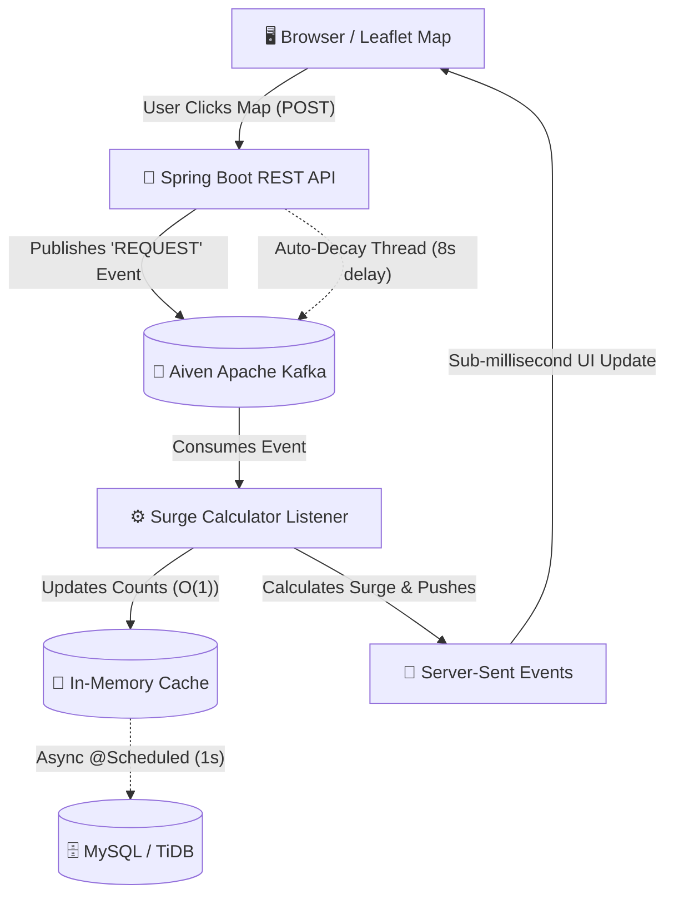

# 🚖 Dynamic Surge Pricing Engine


A production-grade, event-driven geospatial surge pricing engine. This project simulates the complex backend architecture used by ride-sharing companies (like Uber or Lyft) to calculate real-time dynamic pricing based on geographical demand.

## ✨ Key Features

- **🗺️ Interactive Geospatial Map:** A real-time `Leaflet.js` map centered on Bangalore, India. Spam-click anywhere on the map to organically generate ride requests in specific quadrants!
- **⚡ Event-Driven Pipeline:** Every map click fires an event into an **Aiven Apache Kafka** cluster, entirely decoupling the frontend from the pricing calculator.
- **🚀 Server-Sent Events (SSE):** The backend streams price updates directly to the browser in sub-milliseconds, completely eliminating the need for expensive HTTP polling.
- **🧠 In-Memory Batching:** The Kafka Consumer aggregates 1000s of events in a high-speed `ConcurrentHashMap`. A background `@Scheduled` worker flushes the final state to **MySQL** every 1 second, protecting the database from high-throughput crashes.
- **📉 Auto-Decaying Physics:** Simulated rides don't stay open forever! An async multi-threaded worker dispatches "COMPLETE" events 8 seconds after a request, mimicking drivers picking up passengers and naturally cooling down the surge map.
- **📊 Live Analytics:** A real-time `Chart.js` graph plots the surge multipliers for all 4 zones over a sliding 60-second historical window.

## 🏗️ System Architecture



## 💻 Tech Stack

* **Frontend:** Vanilla JavaScript, HTML5, CSS3, Leaflet.js, Chart.js
* **Backend:** Java 21, Spring Boot 3, Spring Web, Spring Kafka, Spring Data JPA
* **Message Broker:** Apache Kafka (Hosted on Aiven Cloud)
* **Database:** MySQL (Hosted on TiDB Serverless)

## 🚀 How to Run Locally

### 1. Prerequisites
Ensure you have the following installed:
- Java 21+
- Gradle

### 2. Configure Database & Kafka (Securely)
This project requires an active MySQL connection and an Apache Kafka cluster. Do **NOT** hardcode your credentials! 
Create a `.env` file in the root directory (it is ignored by Git) and add your credentials:
```env
DB_URL="jdbc:mysql://<your-db-url>:4000/test?ssl=true"
DB_USERNAME="<your-username>"
DB_PASSWORD="<your-password>"
```
*(Your Kafka SSL certificates `ca.pem`, `service.cert`, and `service.key` should be placed in `src/main/resources/`)*

### 3. Start the Server
Open your terminal and run the helper script (which loads the `.env` and starts Spring Boot):
```bash
./run.sh
```

### 4. Interact with the Dashboard
Open your web browser and navigate to:
```
http://localhost:8080
```
- **Simulate Demand:** Click rapidly inside any of the 4 colored quadrants on the map.
- **Watch the Surge:** As a zone crosses 5 active rides, the price will surge to `1.5x` and the map will turn yellow. At 10 rides, it surges to `2.0x` and turns red.
- **Observe the Auto-Decay:** Stop clicking and watch the Chart.js graph. After 8 seconds, the simulated drivers will arrive, the rides will complete, and the surge will naturally decay back to 1.0x!
- **Emergency Reset:** If the map gets too crazy, click the red **🚨 EMERGENCY SYSTEM RESET 🚨** button to instantly flush the entire Kafka pipeline back to zero.

## 🐳 Docker Deployment

This repository includes a multi-stage `Dockerfile`. You can easily deploy this engine to any cloud provider (Render, Railway, AWS, DigitalOcean) with zero configuration:
1. Connect your GitHub repository to your cloud provider.
2. Add `DB_URL`, `DB_USERNAME`, and `DB_PASSWORD` to your provider's Environment Variables dashboard.
3. Deploy! The Dockerfile will automatically build the Gradle project and launch the server.

## 👨‍💻 Author
**Faiz Alam** 
*Building scalable distributed systems.*